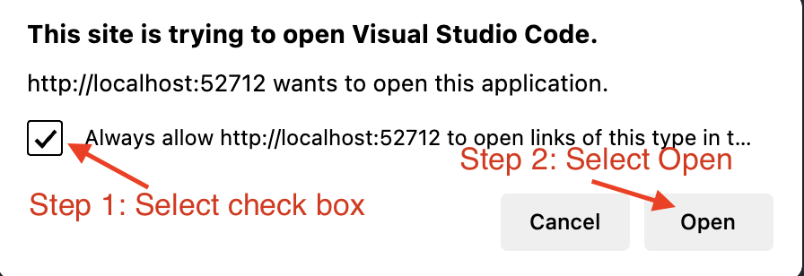

@lab.Title

Login to your VM with the following credentials...

**Username: ++@lab.VirtualMachine(Win11-Pro-Base-VM).Username++**

**Password: +++@lab.VirtualMachine(Win11-Pro-Base-VM).Password+++** 

---

# Introduction to Fluid Framework

# Goal for this lab

Building a modern real time recruitment pipeline management app with features that include:
- SharePoint Embedded as backend
- AI Collaboration
- Multi User presence

## Setup SharePoint Embedded Backend

The first step to setup the Sharepoint Embedded Container for powering the data store for realtime collaboration is through the Azure CLI and Sharepoint Embedded VS Code extension.

1. Setup Azure CLI

	We will first log into and setup the Azure CLI. This is required to create and configure the Microsoft Entra App that controls the permissions and setup for our client application that we will be building. 

	We have created a script which is un the C:\Users\LabUser\Documents\Lab440Content folder.

	Before we run the script, we will open PowerShell and log into the Azure Account from CLI. To do tha, we will run the following command:
	`az login --allow-no-subscriptions`

	In the log in window that appears, select "Work or School Account" and then use the following credentials of your M365 Tenant:

	Username:
	+++@lab.CloudCredential(IgniteLAB440-CredentialPool).AdministrativeUsername+++

	Password:
	+++@lab.CloudCredential(IgniteLAB440-CredentialPool).AdministrativePassword+++

	Proceed by selecting Yes to all default options and your Azure CLI will be setup.

1. Create Microsoft Entra App

	Once your Azure CLI is setup, we can run the Microsoft Entra App creation script which is in the C:\Users\LabUser\Documents\Lab440Content folder. Continuing in PowerShell, navigage to this folder and run the "CreateEntraApp.ps1" script using command `.\CreateEntraApp.ps1`. 

	This script will create the App, Setup right permissions and redirect uris allowed for the app. We will continue to VS Code Extension setup next where we will do other steps to setup SharePoint Embedded.

1. Setup VS Code Extension

	Open Visual Studio Code on your lab machine where the Sharepoint Embedded extension is installed. Refer the image below to open the extension and then use the credentials below to sign into your M365 tenant. If you logged into the CLI in step above, you will also be able to select the signed in account and skip entering the credentials. The admin credentials are provided below:

	Username:
	+++@lab.CloudCredential(IgniteLAB440-CredentialPool).AdministrativeUsername+++

	Password:
	+++@lab.CloudCredential(IgniteLAB440-CredentialPool).AdministrativePassword+++

	

1. Allow VS Code Extension to manage your resources

	Once signed in, give VS Code extension the permissions to create resources on your behalf. See the image below for reference.

	

1. Complete the sign in process

	Follow the prompts and allow the sign in process to complete. Some pop-ups that would come to allow sign in redirects (see image below for reference)

	
	

1. Create Container Type

	Next, we will create a container type which is of type trial container that allows creation of temporary development resources. Type in the name and press Enter and wait for next prompt to load. See the image below for reference.

	

1. Configure Owning App for Container Type

	Next, it will give you a prompt to select the owning app for this new container type. We will use the Entra App which we created above which will own this new container type. It might take a few seconds for the new app to show up. Follow all the prompts that show up on bottom right part of Visual Studio Code and allow the app configuration to complete. See the image below for reference.

	

1. Register Container Type and associated permissions with tenant

	Now that we have specified the permissions required, we will now register this new container type and associated permissiosn with the tenant to allow these new permissions that the consuming app will need. To do that, we will, select the Container Type that we created, Right Click it and select "Register on local tenant". Please refer to image below.

	

	This will create a pop-up on bottom right side in VS Code. In the pop-up, select the "Open Consent Link" button. This will open a permissions prompt where we view and verify the permissions the App is going to get, and then allow it.

	

	This will open a page in browser with list of permissions, which we will Accept to proceed further.

	

	That's it! Now all the permissions and backend for using SharePoint Embedded is fully setup. 
	
1. Extract required backend configuration for the app

	The last step is to retrieve the configuration for this setup. We can easily fetch that from the VS Code SharePoint Embedded Extension also. In VS Code, Right-click on the Container Type and select "View Properties". See image below for reference.

	

	This will display all the configration properties. The following keys are of our interest which we will copy into the `.env` file of our app.

	```
	"OwningAppId": "1e761d92-986a-xxxx-xxxx-xxxxxxxxxx",
	"ContainerTypeId": "6759b8da-xxxx-xxxx-xxxx-xxxxxxxx",
	"OwningTenantId": "501a7815-xxxx-xxxx-xxxx-xxxxxxxxxx",
	```

## Configuration for Azure OpenAI Endpoint

All lab attendees get their own OpenAI endpoint to play around with varied requests. The resources are created already and here's the configuration to put it in the app's .env file.

OpenAI Endpoint

@lab.CloudResourceTemplate(Lab440AzureOpenAIResourceCreation).Outputs[openAIEndpoint]openai/deployments/gpt4o/chat/completions?api-version=2024-08-01-preview

OpenAI API Key

@lab.CloudResourceTemplate(Lab440AzureOpenAIResourceCreation).Outputs[openAIKey]

Copy below configuration and append it to the `.env` file of the application.

```
AZURE_OPENAI_ENDPOINT='@lab.CloudResourceTemplate(Lab440AzureOpenAIResourceCreation).Outputs[openAIEndpoint]openai/deployments/gpt4o/chat/completions?api-version=2024-08-01-preview'
AZURE_OPENAI_API_KEY='@lab.CloudResourceTemplate(Lab440AzureOpenAIResourceCreation).Outputs[openAIKey]'
```