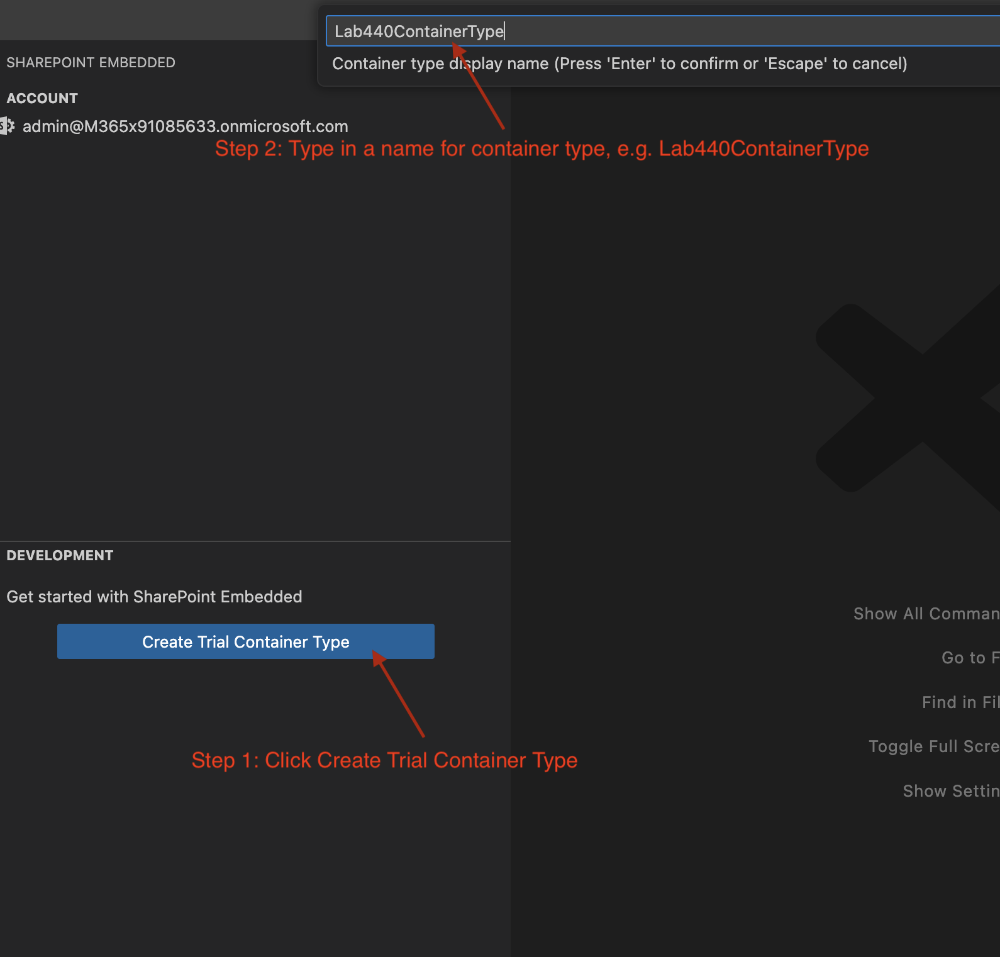
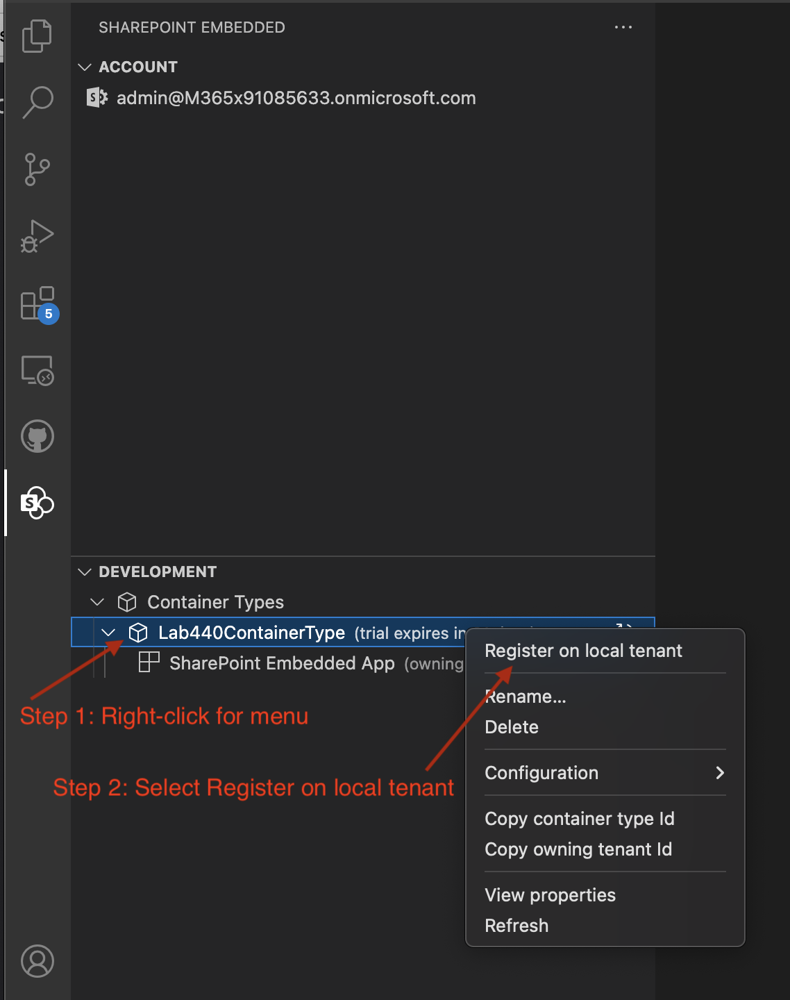
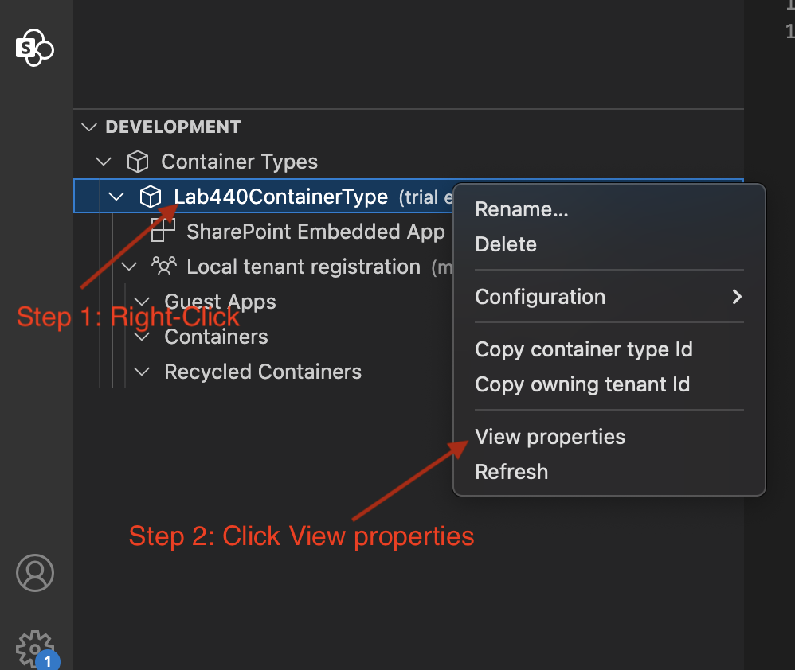

@lab.Title

Login to your VM with the following credentials...

**Username: ++@lab.VirtualMachine(Win11-Pro-Base-VM).Username++**

**Password: +++@lab.VirtualMachine(Win11-Pro-Base-VM).Password+++** 

---
# Goal for this lab

Building a modern real time recruitment pipeline management app using Fluid Framework with features that include:

- Multi User presence
- AI Collaboration
- SharePoint Embedded as backend

***

## Module 0 - Starting with a non-Fluid app and understanding app features

1. Open the Power Shell by clicking on the taskbar icon
2. Go to the app code directory by typing this command - `cd C:\Users\LabUser\Documents\Lab440Content\hr-recruitment-dashboard`
3. Launch VSCode to start editing the project - `code .`
5. Go back to the PowerShell window and install the dependencies by using the command - `npm i`
6. Run the app - `npm run dev`

	>This should take a minute, wait for the server to be booted and app deployed before moving to the next step. You'll see a message saying "webpack compiled successfully".

7. Open Microsoft Edge browser by clicking on the taskbar icon.
8. Visit - `http://localhost:8081/`. Play around with the app to understand the HR app features.
8. Go back to VSCode and open file src/mod0/appSchema.tsx file and go through the app's data model.

	>Feel free to browse the other code to understand how the app works

#### Great! you should see the basic non-Fluid non-collaborative app working now!

***

## Module 1 - Adding Fluid support

1. In VSCode, open file tsconfig.json, change line 15 to: `"@lab/*": ["mod1/*"],`

	> Make sure to save all files as you are making code changes throughout this lab!

2. Open file webpack.config.cjs, change line 50 to: `"@lab": path.resolve(__dirname, "src/mod1"),`
3. **Restart the app** - Go back to the PowerShell window and type **CTRL + C** on the keyboard twice, then re-run the `npm run dev` command

	> While the app restarts, you can proceed to code changes below!

4. Go back to VSCode and open file src/hr_app.tsx
	* Comment out lines 20-21
	* Uncomment lines 24-25
	
	> An easy way to comment lines in or out is to select the relevant lines and hit **CTRL + /** keys. Memeroize this, you'll be needing this a lot!
5. Open file src/index.tsx, 
	* Comment out line 29
	* Uncomment line 33
    * Uncomment lines 63-80
6. Open file src/ux/jobsListView.tsx
	* Uncomment line 19
	* Uncomment line 118
7. Open file src/ux/candidateListView.tsx
	* Uncomment lines 20-21
	* Uncomment line 126
8. Open file src/ux/onSitePlanView.tsx
	* Uncomment lines 16-18
9. Open file src/ux/interviewPoolView.tsx
	* Uncomment line 54
10. Open file src/ux/availabilityView.tsx 
	* Uncomment line 8
11. Open and inspect file src/mod1/appSchema.tsx to view the SharedTree schema for the same data model

> Note the small differences between the Fluid mod1/appSchema and non-Fluid mod0/appSchema. Fluid makes it super easy to move existing apps and data models over, requiring minimal UI changes!

12. Go back to the browser and refresh the page. Now you should see the URL change.
13. Copy the longer URL and open another browser tab and paste it. This will allow you to see how multiple users can collaborate on the app. Make any changes in one tab and see them replicated in the other tab immediately!

#### Awesome! Now your app is collaborative using Fluid!

## Module 2 - Adding User Presence - the ability to see other users working in the app!

1. Open file src/index.tsx
	* Uncomment lines 84-90
2. Inspect file src/hr_app.tsx line 96 for the AppPresenceGroup (lines 165-199)
3. Inspect file candidatesListView.tsx for listening to remote updates, setting local state and the avatarGroupView
4. Inspect file jobsListView.tsx for listening to remote updates, setting local state and the avatarGroupView
5. Re-load both browser tabs. 

	>You should now be able to see two users in the top right corner of the screen. This shows all of the users that are in the app right now, you can open more tabs to see more users added. As you select different jobs and candidates in one tab, you should see the presence information showing up in the other tabs!

#### Now you can see what jobs and candidates others are looking at in real-time!

## Module 3 - Adding AI Chat view

### Adding Open AI Config

For adding the AI Chat view, you will  need the Azure Open AI endpoint and API Key for the app, here's the configuration for it. 

	
	AZURE_OPENAI_ENDPOINT='@lab.CloudResourceTemplate(Lab440AzureOpenAIResourceCreation).Outputs[openAIEndpoint]openai/deployments/gpt4o/chat/completions?api-version=2024-08-01-preview'
	AZURE_OPENAI_API_KEY='@lab.CloudResourceTemplate(Lab440AzureOpenAIResourceCreation).Outputs[openAIKey]'
	

>Add the above configuration in the ".env" file which is in the root of your app folder.

### Adding AI Chat View in the App

1. Open file tsconfig.json, change line 15 to: `"@lab/*": ["mod3/*"],`
2. Open file webpack.config.cjs, change line 50 to: `"@lab": path.resolve(__dirname, "src/mod3"),`
3. **Restart the app** - Go back to the command prmopt window and type **CTRL + C** on the keyboard twice, then re-run the `npm run dev` command
4. Inspect file mod3/appSchema.tsx to see the schema updates to make it easier for AI models to better understand your data
5. Inspect file mod3/aiChatView.tsx file to see the AI Collab APIs being used
6. Open file hr_app.tsx
	* Uncomment lines 75-82
7. Go back to the browser and ask the AI to perform various actions on your data!
	* TODO: Add some sample prompts that people can try on their own

#### Congratulations on turning your non-collab react app into a Fluid-powered collab app with User presence and AI features!

## Module 4 - Adding SharePoint Embedded Backend

Now that you have everything working locally, it's time you setup the app with a cloud backend to power collaboration and data storage in the cloud and unlock SharePoint eco system features with Fluid!

### Setup SharePoint Embedded Backend

The first step to setup the Sharepoint Embedded Container for powering the data store for realtime collaboration is through the Azure CLI and Sharepoint Embedded VS Code extension.

1. Setup Azure CLI

	You will first log into and setup the Azure CLI. This is required to create and configure the Microsoft Entra App that controls the permissions and setup for our client application that we will be building. 

	1. Go back to PowerShell and open a new tab
	
	1. Use command `cd C:\Users\LabUser\Documents\Lab440Content\hr-recruitment-dashboard` to go to the folder which has the backend resource creation script
	
	1. Run command `az login --allow-no-subscriptions` to log into Azure CLI and use the credentials below to login.
	**Important:** In the log in window that appears, select "Work or School Account" and then use the following credentials of your M365 Tenant:

		Username:
		+++@lab.CloudCredential(IgniteLAB440-CredentialPool).AdministrativeUsername+++

		Password:
		+++@lab.CloudCredential(IgniteLAB440-CredentialPool).AdministrativePassword+++

		Proceed by selecting Yes to all default options and your Azure CLI will be setup. If prompted "Stay signed into all your apps", select OK (see image below)
		

1. Create Microsoft Entra App

	Next, you need to create a Microsoft Entra App which is the App that that has the permissions and other resource setup required for the client app. To do that:

	1. Continuing in PowerShell from the same folder as above, run `.\CreateEntraApp.ps1` script which will create the Entra App in Azure.

1. Setup VS Code Extension

	1. Go to Visual Studio Code IDE

	1. Open the SharePoint Embedded Extension and click "Sign into Microsoft 365" (Refer Image 1 below).

	   > If you logged into the CLI in step above, you will also be able to select the signed in account and skip entering the credentials. In case you need the credentials, the admin credentials are provided below. 
	
	1. You will be presented with a pop-up asking for permissions to manage the app through VS Code Extension. 
	
	1. Select the checkbox in permissions dialog and then hit Accept(Refer Image 2 below). 
	
	1. You will then see some prompts that will pop-up to complete sign in process and open the browser/IDE(Refer Image 3 and Image 4 below).

	Username:
	+++@lab.CloudCredential(IgniteLAB440-CredentialPool).AdministrativeUsername+++

	Password:
	+++@lab.CloudCredential(IgniteLAB440-CredentialPool).AdministrativePassword+++

	**Image 1**
	

	**Image 2**
	

	**Image 3**
	

	**Image 4**
	

1. Create Container Type

	1. Next, Create a Container Type by clicking on "Create Trial Container Type" in the SharePoint Embedded VS Code Extension
	1. Give it a name like `Lab440ContainerType` and then hit Enter and wait for next prompt asking for Owning App. (Refer Image 5 below) 
	1. Select the Entra App we created in the script above named `Lab440 SPE App` from the list (Refer Image 6 below). 
	> **Important** Do not choose the Create Azure App option. It is imporant that we use the app we created, which is `Lab440 SPE App`. 
	
	> Follow any/all prompts that show up in bottom right part of your IDE and select default/Yes options for these. 

	**Image 5**
	

	**Image 6**
		

1. Register Container Type and associated permissions with tenant

	If you missed any of the pop-ups and have not registered the container type with local tenant, you need to do that now. 
	1. Select the Container Type that we created from SPE VS Code Extension 
	2. Right Click it and select "Register on local tenant"  (Refer Image 7 below) which will create a pop-up on bottom right in VS Code.

	**Image 7**
	

	1. Click "Create Certificate credential in the pop up (refer Image 8 below)

	**Image 8**
	

	1. Next, there will be another pop-up on bottom right side in VS Code. In the pop-up, select the "Open Consent Link" button. (Refer Image 9 below)

	**Image 9**
	

	This will open a page in browser with list of permissions, which we will Accept to proceed further.

	

	That's it! Now all the permissions and backend for using SharePoint Embedded is fully setup. 
	
1. Extract required backend configuration for the app

	The last step is to retrieve the configuration for this setup. We can easily fetch that from the VS Code SharePoint Embedded Extension also. In VS Code, Right-click on the Container Type and select "View Properties". See image below for reference.

	

	This will display all the configration properties. The following keys are of our interest which we will copy into the `.env` file of our app.

	```
	"OwningAppId": "1e761d92-986a-xxxx-xxxx-xxxxxxxxxx",
	"ContainerTypeId": "6759b8da-xxxx-xxxx-xxxx-xxxxxxxx",
	"OwningTenantId": "501a7815-xxxx-xxxx-xxxx-xxxxxxxxxx",
	```

	You will have to copy the relevant information in your .env file of the app.
	TODO: Fix me, these instructions are little rough and need to be polished (integrated owning app id, container type id and such)

	> Copy over the values from the VM setup including OwningAppId, ContainerTypeId and OwningTenantId to the .env file

#### Phew, that was a lot but you made it! You've finished setting up a SharePoint Embedded tenant and configured it for your app. Good news is... you only need to do this once!

### Now, let's update the app to run on SharePoint Embedded
1. Go back to VSCode and open src/infra/speStart.tsx
	* Uncomment lines 186-198
2. **Stop the app** Go back to PowerShell and switch to the tab running the app and type **CTRL+C** twice
3. Run this command to launch your app against the SPE tenant you just created: `npm run dev:spe`
4. Go back to the browser and visit `http://localhost:8081/`

#### All set! now the same exact app is running on SharePoint Embedded!
